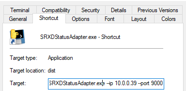
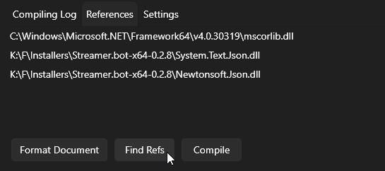

# Streamerbot SpinRhythm Credits Tools
### Tools to make SpinRhythm more stream friendly.
- Send track information
- Send credit information

# Prerequisites
#### _This is for Windows 10/11 Computers_
### For adding more capabilities to SpinRhythmXD on steam
[General Instructions](https://steamcommunity.com/sharedfiles/filedetails/?id=3339937862)  
[BepInEx 5.4.23.5](https://github.com/BepInEx/BepInEx/releases/)  
[SpinCore Mod v1.2.0](https://github.com/Raoul1808/SpinCore/releases/tag/v1.2.0)  
[SpinStatus Mod 0.4.0](https://github.com/TakingFire/SpinStatus/releases/tag/v0.4.0-alpha)  

## Recommended
[MuteTwitchVODTrack](https://github.com/TheBlackParrot/MuteTwitchVODTrack)

### Quick Install
Now that it's compiled with pyinstaller. Just run SRXDStatusAdapter.exe and connect to it with StreamerBot on port 9000.

#### Dual PC Setup
Run SRXDproxy.exe on the computer with the game  

Run SRXDStatusAdapter.exe on the computer with Streamerbot as a shortcut  
make sure adding the ip and the port (default 9000) of the computer with the SpinRhythm game using flags




### Build/Compile

#### Dependencies
```pip install asyncio```
```pip install websockets```

or ```python -m pip install asyncio websockets```  
depending on if you run multiple python versions

I've used pyinstaller with multiple python installations so this is what I did  
```python3.14 -m pip install pyinstaller```  
```python3.14 -m PyInstaller --onefile .\SRXDStatusAdapter.py```
```python3.14 -m PyInstaller --onefile .\SRXDproxy.py```


# SpinRhythmSB.cs
is the code to receive websocket information from SRXDStatusAdapter.exe and send the Track info and credits into the chat.
Make sure to match the ip localhost/127.0.0.1 and the port 9000.  

you can change them later if you want!



There is a credits template that already exists for the base game. Feel free to use.

# SRXDStatusAdapter.exe
The main program that looks for the [SpinStatus](https://github.com/TakingFire/SpinStatus/tree/main) mod and sends the information to streamerbot where it is written in the data variable in the action

### Default
Will connect to a local instance of SpinStatus/SpinRhythm  
and connect to a local StreamerBot on port 9000
### Custom
Instead you can add flags  

| **flag** | **description**                                                             |
|----------|-----------------------------------------------------------------------------|
| --ip     | ip of the machine you are running SpinRhythm with SpinStatus or the proxy   |
| --port   | port of the machine you are running SpinRhythm with SpinStatus or the proxy |
| --sbip   | ip of the machine running StreamerBot                                       |
| --sbport | port of the machine running StreamerBot                                     |


In this example
```
SRXDStatusAdapter.exe --ip 192.0.0.1 --port 9000
```
You changed the address and port of the computer you want to another local computer.


# SRXDproxy.exe
This helper program exposes the localhost websocket in SpinStatus to other computers on the network i.e. dual pc streaming.
